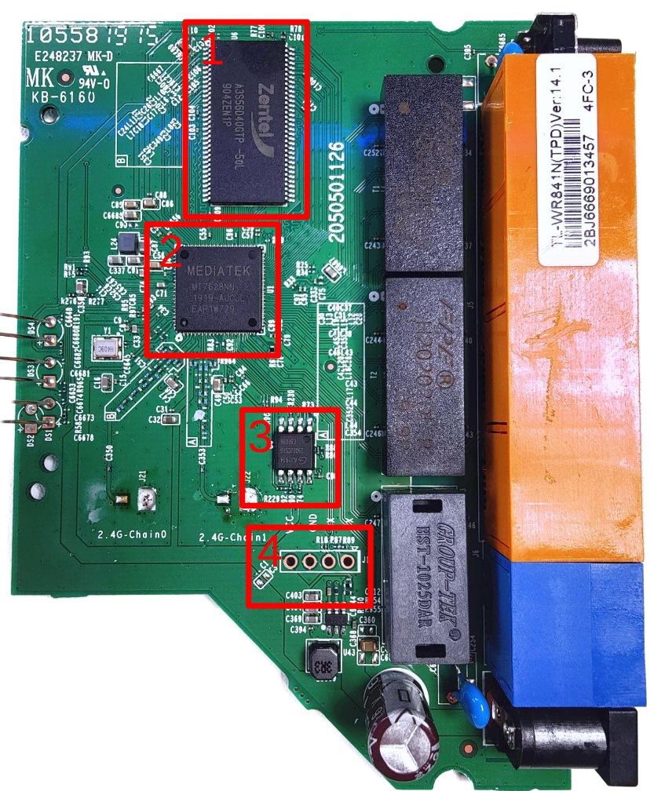
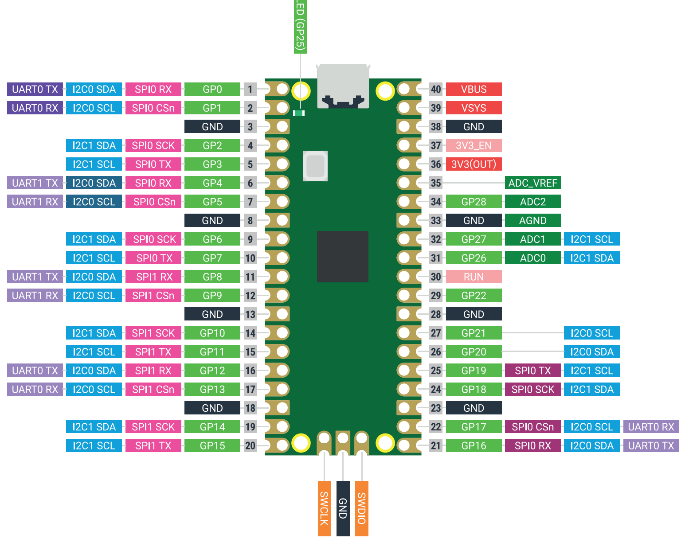

# Hardware Hacking 101

One of the first steps in hardware hacking is to conduct a visual inspection of the PCB (Printed Circuit Board). This process helps us understand how the hardware is designed, identify the components used, and determine how these components communicate with each other. In this exercise, you will examine the PCB of a router to identify key components and understand their functions.

## Exercise 0x01 - Router Inspection

In this exercise, we will inspect the router's PCB to identify crucial components and learn more about the device's design. Follow the steps below to begin.

### Step 1: Locate the FCC ID

Identify the FCC ID (Federal Communications Commission Identification) of the router. This unique identifier is essential for retrieving regulatory documentation, including internal photos, testing reports, and other technical information. Once you find the FCC ID:

1. Go to the [FCC ID search page](https://fccid.io/).
2. Enter the FCC ID to download the internal photos and other documentation for the router.

### Step 2: Identify Components on the PCB

Examine the PCB image below. Identify and document the function of each marked component.



Complete the table below with the following information for each component:

1. **Vendor**: The manufacturer of the component.
2. **Purpose**: A brief description of the component's role within the router.

| Component # | Vendor | Purpose                          |
|-------------|--------|----------------------------------|
| 1           |        |                                  |
| 2           |        |                                  |
| 3           |        |                                  |
| 4           |        |                                  |


---


## Exercise 0x02a - UART Decoding

In this exercise, you will decode a UART message to uncover a hidden flag. UART (Universal Asynchronous Receiver/Transmitter) is a common communication protocol in embedded devices. By analyzing UART signals, we can often extract valuable information from devices.

### Step 1: Open the Signal File

1. Open the file located at `challenges/uart_challenge_decoding.sigrok` in Sigrok, a tool for analyzing signal captures.
2. Use Sigrok's decoding feature to interpret the UART signals recorded in this file.

### Step 2: Decode the UART Message

1. Carefully examine the decoded UART data in Sigrok.
2. Identify and isolate the flag embedded within the message. The flag is formatted as `flag{...}`.

### Record the Flag

Once you have successfully decoded the message, enter the extracted flag below:

```plaintext
Flag: flag{               }
```

By completing this exercise, you will gain practical experience with UART signal analysis and learn how to extract valuable information from raw communication data.


## Exercise 0x02b - Obtaining a Root Shell via UART

In this exercise, you will connect to a router via UART using a Raspberry Pi Pico, then attempt to access a root shell on the device. The goal is to interact with the router and retrieve information from the filesystem.

### Step 1: Connect the Raspberry Pi Pico to the Router

1. Connect **UART0** on the Raspberry Pi Pico to the router's UART header.
2. Use the table below to guide your connections between the Pico and the router.

| Router Pin | Pico Pin | Pico Pin Description |
|------------|----------|----------------------|
| RX         |          | UART0 TX (Transmit)  |
| TX         |          | UART0 RX (Receive)   |
| GND        |          | Ground               |

Refer to the Raspberry Pi Pico pinout below to identify the correct pins for **UART0 TX**, **UART0 RX**, and **GND**:

<p align="center">
  
</p>

Ensure the connections are secure and correctly matched to enable stable UART communication
### Step 2: Establish a UART Shell

1. Write a MicroPython script to facilitate data transmission between the Raspberry Pi Pico and the router’s UART connection.
   - This script should enable bidirectional communication, allowing the Pico to both send commands to the router and receive its output.
2. Use a USB serial console on your computer to log the input and output from this connection.
   - This will help you monitor the communication and issue commands directly to the router.

### Step 3: Retrieve System Information

1. Once connected to the router, access a shell prompt.
2. Run the command to read the contents of the `/etc/passwd` file. This file often contains user account information, which may be helpful for further analysis.

### Log the Contents of `/etc/passwd`

Record the contents of the `/etc/passwd` file below:

```bash
$ cat /etc/passwd


```

## Exercise 0x03a - Reading the Flash Memory

In this exercise, you will identify and research the flash memory chip used in the WiFi router. This will help you understand how data is stored and accessed within the device.

### Step 1: Flash Memory Reconnaissance

1. **Open the Router**: Carefully open the WiFi router to access the internal components.
2. **Identify the Flash Memory Chip**: Locate the flash memory chip on the router's PCB

3. **Research the Flash Memory Chip**:
   - Look up the part number on the chip to identify the manufacturer and model.
   - Search for the datasheet online to find detailed specifications and communication protocols.

### Step 2: Answer the Following Questions

Based on your findings, answer these questions:

1. **Which Flash Memory Type is Used?**
   - Determine whether the router uses NOR, NAND, or another type of flash memory. Describe its primary characteristics.

2. **Which Communication Protocol is Used?**
   - Identify the communication protocol the router uses to interface with the flash chip (e.g., SPI, I2C, parallel). This information is typically found in the datasheet.


3. **Which Command(s) Need to Be Sent to Read Data?**
   - Refer to the flash memory datasheet to determine the specific commands required to read data from the chip. Document any relevant hex codes or sequences.


## Exercise 0x03b - Dumping the Flash Content

In this exercise, you will write a MicroPython script to dump the contents of the flash memory chip on the router using a Raspberry Pi Pico. The goal is to extract specific data, such as the U-Boot version, from the flash chip.

### Goal

Write a MicroPython script for the Raspberry Pi Pico that connects to the flash chip and reads its contents.

### Step 1: Connect the Raspberry Pi Pico to the Flash Chip

Use the table below to connect the Raspberry Pi Pico to the flash memory chip on the router. Reference the flash chip’s datasheet for pin details to ensure correct connections.

| Flash Chip Pin | Pico Pin | Pin Description            |
|----------------|----------|----------------------------|
| CS#            |          | Chip Select                |
| DO             |          | Data Out (MISO)            |
| WP#            |          | Write Protect              |
| VSS            |          | Ground                     |
| VCC            |          | Power Supply               |
| CLK            |          | Clock                      |
| DI             |          | Data In (MOSI)             |

Ensure each connection is secure and that the power and ground lines are properly matched.

### Step 2: Send a READ Command and Dump Flash Memory

Write a MicroPython script to interface with the flash memory chip over SPI.
Your script should include commands to initialize the SPI connection, send the **READ** command, and read data from memory.

### Step 3: Extract the U-Boot Version

Start reading data from address `0x0000d120`, where the U-Boot version information is stored.

### Log the U-Boot Version

Record the U-Boot version you found below:

```plaintext
U-Boot Version: [Your U-Boot Version Here]
```

---

Good luck, and happy hacking!
